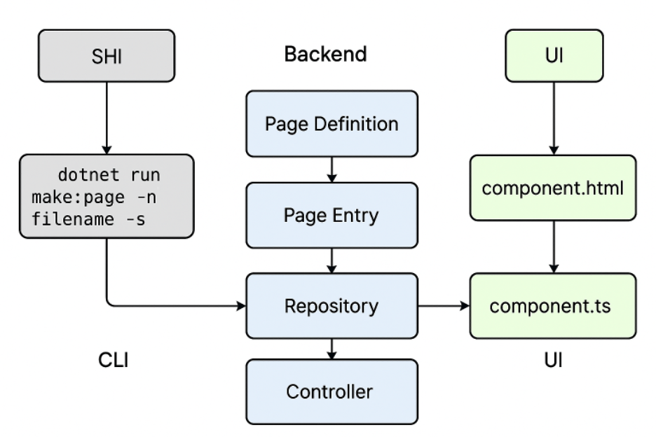

Creating a New Tabbel 

Objective
This document describes the steps followed to create and configure a new tabbel in the DevStack environment using the elfsquadcli tool.

1. Prerequisites
    •	Ensure devstack and cpq are sibling directories.
    •	The cpq project should be located at:

../../cpq/projects/cpq

relative to the GeneralPurposeCLI directory.

    •	If your setup differs, adjust the path accordingly.

2. Switching to the Correct Branch and Directory

git checkout elfsquadcli
cd GeneralPurposeCLI

3. Generating the Page Files

Run the following shell command:

dotnet run make:page -n <filename> -s

Output:
This generates three files:
    1.	Page Definition
    •	Location: Elfskot.Core.Pages.Definitions
    •	Purpose: Returns the model to be sent to the table component.
Business logic should be applied here (service-class style).
    2.	Page Entry
        •	Location: Elfskot.Core.Pages.Entries
        •	Purpose: Acts as a model representation.
    3.	Repository
        •	Location: Elfskot.Core.Pages.Repositories

Additionally, a Controller is created under:

Elfskot.Api.Controllers.Ems.Pages

    •	Add the page route, e.g.:

[Route("ems/pages/configurationmodels")] 
This should be same as one that you put in PageTableName.cs

    •	No extra endpoints are required unless there’s an explicit call beyond basic CRUD.
(BasePageController already implements standard CRUD.)

4. Service and Configuration Updates

Make the following entries:
    1.	ServiceCollectionExtensions.cs
Path: projects/cpq/src/Core/Elfskot.Core/Pages/Extensions/ServiceCollectionExtensions.cs
Example:

services.AddTransient(typeof(IPagesRepository<AssignUserToRolePageEntry>), typeof(AssignUserToRoleRepository));

    2.	PageTableName.cs
Path: projects/cpq/src/Core/Elfskot.Core/Pages/Services/PageTableName.cs
Example:

public const string CONFIGURATION_MODELS_TABLE_URL = "configurationmodels";

    •	This string is the API URL used in the UI.

    3.	Startup.cs
Path: projects/cpq/src/Web/Elfskot.Api/Startup.cs
Example:

services.AddTransient(typeof(IPageDefinition), typeof(CopyConfigurationToQuotationPageDefinition));

    4.	TabbelPreferenceTestData.cs
Path: projects/cpq/src/Tests/Elfsquad.Tests.Integration/Pages/TabbelPreferenceTestData.cs
    •	Add an entry to enable automated test cases for the new table.

5. UI Implementation

HTML (component.html)

Create or update the tabbel component:

<tabbel class="tabbel" 
        rowHeight="49px" 
        [endpoint]="configurationmodels" 
        [queryParams]="queryParams"  
        [selectOnRowClick]="true" 
        #datatable>
</tabbel>

    •	[endpoint] → URL defined in PageTableName.cs
    •	[queryParams] → Parameters to send with the API request
    •	Other implementation follows the existing table components.

TypeScript (component.ts)
    •	Implement any table-specific logic here.

 
Basic flow diagram

